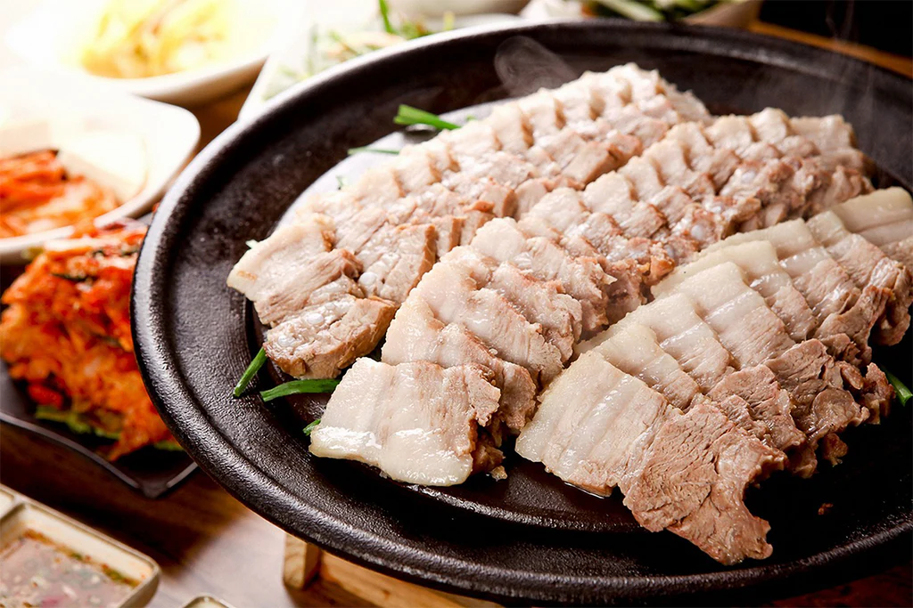
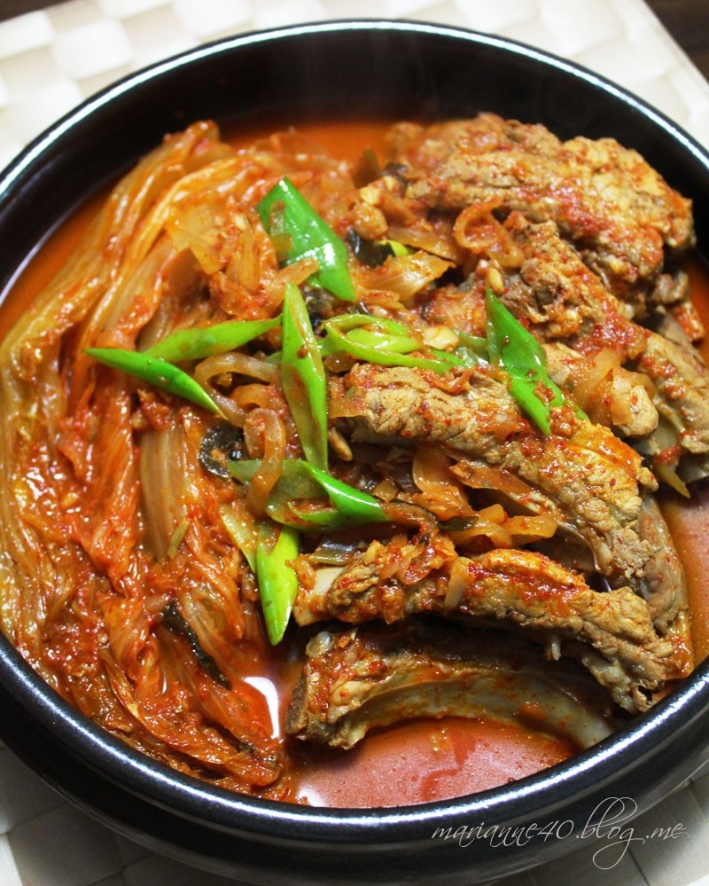
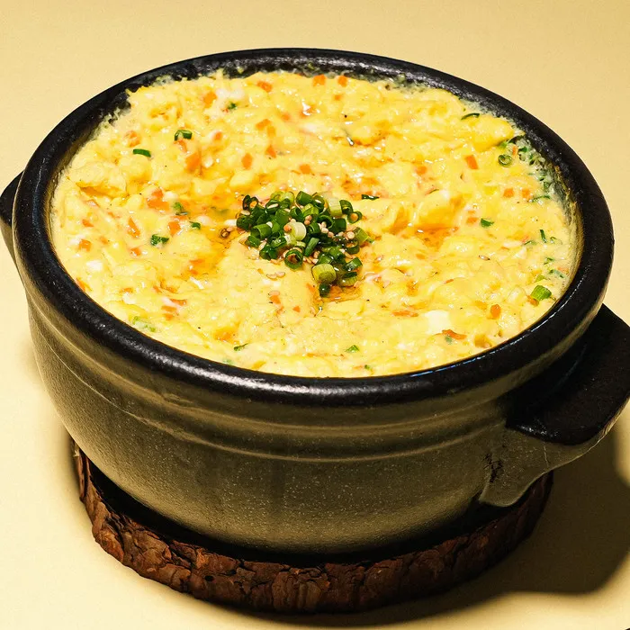
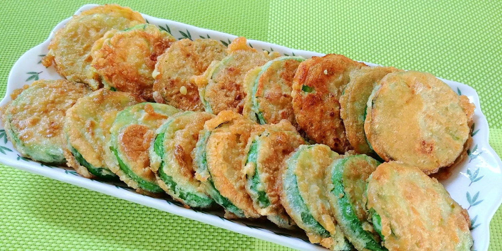
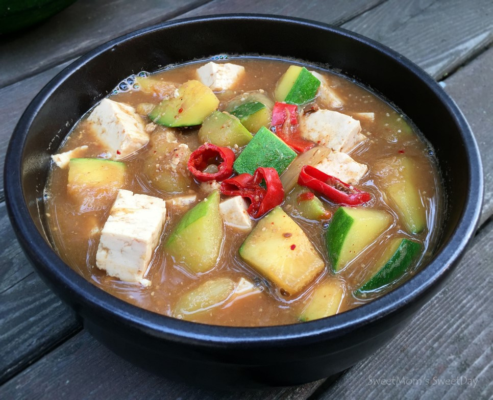
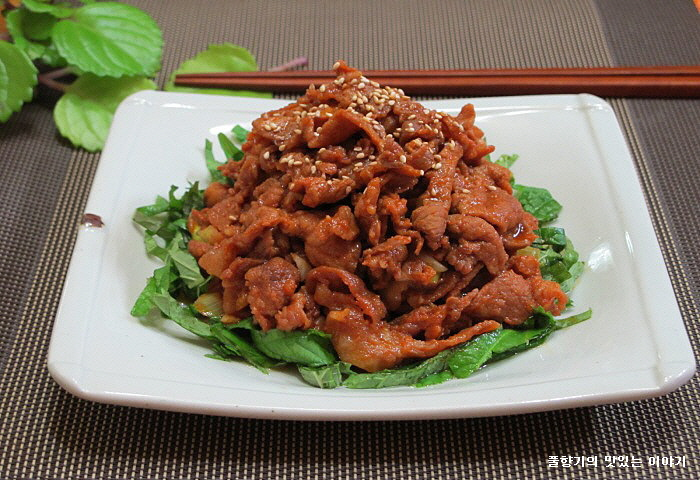
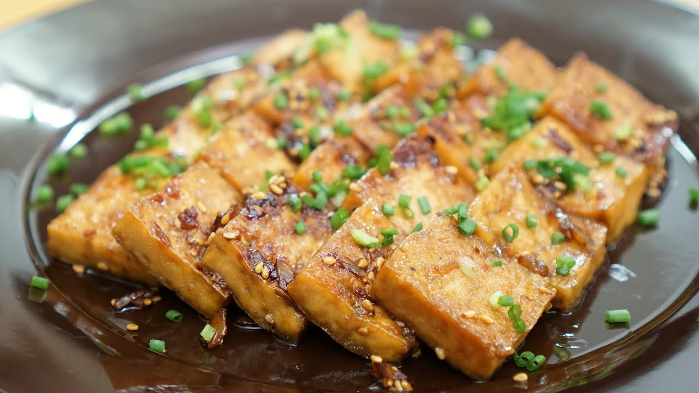
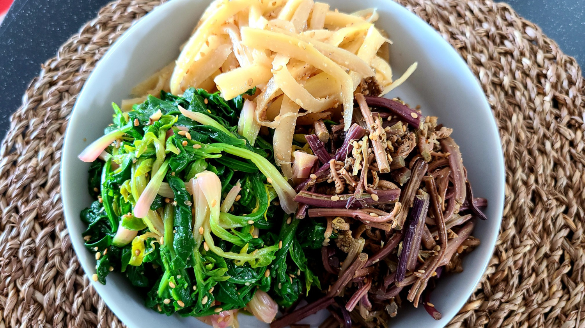

Hello! Are you a hungry soul searching for delicious food? Then you've come to the right place! 😋

### 🎉 Special Thanks
🙏 Shout out to my mom, the best cook I know! Without her, I wouldn't be able to make any of these dishes! Also, a huge thank you to:\
- **Tiana & Liz** for hosting the event 🏡\
- **Jorge** for being the amazing sous-chef 👨‍🍳\
- **Ishaan** for bringing extra food 🍱 \
- **ChatGPT** for making this file "pretty"

💰 *There will be a small charge for groceries (around **$10-15 per person**, depending on attendance).* 

🍶 *There will be Korean rice wine (makgeolli) and soju available to pair with the food!* 🥂

🍚 *There will also be rice provided to complement the dishes!* 🍚

📅 **Looking forward to seeing you all on Saturday at 6pm!** 🍻

#### ⚠️ Disclaimer
- The menu items are subject to availability and may change.
- Actual dishes may differ from the pictures shown.
- Recipes and ingredients may vary based on sourcing and preparation.

---

## 🍛 Main Dishes

### 1️⃣ Bossam / Suyuk (보쌈 / 수육) 

- **Ingredients:** Pork belly, Onion, Doenjang, Garlic, (Beer/Soju, Coffee, Green Onion)\
- **Description:** Tender, slow-boiled pork served with Ssamjang and fresh vegetables (lettuce or ssam mu).
- There will be GF version for Liz.

### 2️⃣ Kimchi-jjim (김치찜) - **GF**

- **Ingredients:** Kimchi, Pork Ribs, Onion\
- **Description:** Slow-braised kimchi and pork ribs

---

## 🥢 Side Dishes

### 1️⃣ Gyeran-jjim (계란찜) - **GF**

- **Ingredients:** Egg, Green Onions, Carrots\
- **Description:** Fluffy, savory steamed egg custard.

### 2️⃣ Hobakjeon (호박전) - **GF**

- **Ingredients:** Zucchini, Egg, Corn starch\
- **Description:** Lightly pan-fried zucchini slices in a crispy egg batter.

### 3️⃣ Doenjang-jjigae (된장찌개)

- **Ingredients:** Doenjang, Tofu, Zucchini, Onion, Potato, Garlic\
- **Description:** Korean soybean paste stew with tofu and vegetables.

### 4️⃣ Kimchi - **GF**

- **Ingredients:** Napa Cabbage, Various Korean seasonings\
- **Description:** The beloved Korean fermented cabbage dish.

---

## 🍰 Dessert 🍧
*To be determined based on grocery availability!*
Possible options:\
- **Hotteok (호떡)** – Sweet Korean pancakes with brown sugar filling\
- **Bingsu (빙수)** – Shaved ice dessert with toppings\
- **Bungeo-ppang (붕어빵)** – Fish-shaped pastry with sweet filling\
- **Korean Icecream**

---

## 🔥 Potential Additional Dishes

### 1️⃣ Jeyuk Bokkeum (제육볶음)

- **Ingredients:** Beef/Pork, Gochujang, Onion, Zucchini, Green Onion, Garlic, Soy Sauce\
- **Description:** Spicy stir-fried beef/pork with a gochujang-based sauce.

### 2️⃣ Dubu Jorim (두부조림)

- **Ingredients:** Tofu, Soy Sauce, Garlic, Sesame Oil, (Green Onion, Onion, Oyster Sauce, Cabbage) \
- **Description:** Braised tofu in a savory soy-garlic sauce.
- Can be made GF

### 3️⃣ Namul (나물) - **GF**

- **Ingredients:** Spinach, Bean sprouts, or other greens\
- **Description:** Lightly seasoned and sautéed Korean vegetable sides.

---

💬 **Questions or special requests? Let me know!** Can't wait to feast with you all! 🍶🥂
