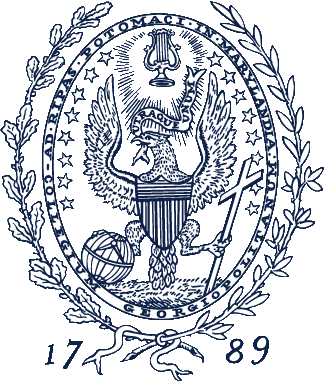

---  
about:
  template: trestles
  image: ./image2.jpg
  links:
    - icon: linkedin
      text: LinkedIn
      href: https://www.linkedin.com/in/brian-kwon-b4258317a
    - icon: github
      text: Github
      href: https://github.com/briansoonwookwon
format: 
  html: 
    embed-resources: true
---

# Brian Kwon
Hi, I’m Brian Kwon—a data scientist who doesn’t just analyze data, but engineers the tools to do it better. With a foundation in statistics and a passion for building, I bridge the gap between analytical insight and scalable code. From machine learning pipelines to full-stack prototypes, my work combines thoughtful research with hands-on development. This portfolio showcases how I turn complex problems into clean, deployable solutions. Outside of academics, I like playing guitar, listening to lots of music, cooking foods, solving Rubik’s cubes, and reading books.

# Education
**MS in Data Science and Analytics**\
*Georgetown University* | Washington, DC | May 2025

- Relevant courses:  
  Big Data and Cloud Computing | ML App Deployment | Computer Vision | Applied Gen AI for Developers | Neural Nets and Deep Learning | Data Visualization  
- GPA: 4.0/4.0

**BA in Social Relations and Policy**\
Statistics Double Major, Data Science Minor\
*Michigan State University* | East Lansing, MI | May 2022
<!-- ::::{.columns}
:::{.column width="15%"}

:::

:::{.column width="3%"}
:::

:::{.column width="82%"}
**M.S in Data Science and Analytics**  
*Georgetown University* | Washington, DC | May 2025  
:::
::::

- Relevant courses:  
  Big Data and Cloud Computing | ML App Deployment | Computer Vision | Applied Gen AI for Developers | Neural Nets and Deep Learning | Data Visualization  
- GPA: 4.0

::::{.columns}
:::{.column width="15%"}

:::

:::{.column width="3%"}
:::

:::{.column width="82%"}
**B.A in Social Relations and Policy**\
Statistics Double Major, Data Science Minor\
*Michigan State University* | East Lansing, MI | May 2022
:::
:::: -->

# Skills

- **Computer**: Python, R, SQL, Git, Bash, Poetry, uv, AWS, Azure, Docker, Qualtrics, Quarto, HTML

- **Packages**: LangChain, PyTorch, Tensorflow, Keras, PySpark, HuggingFace, BeautifulSoup, PyTest, MLFlow, Pydantic, RAGAS, Pinecone, FAISS, Pandas, Scikit-Learn, SciPy, NetworkX, NLTK, Tidyverse

- **Visualization**: Streamlit, Plotly, ggplot, Matplotlib, Seaborn, Leaflet, Folium, Tableau, Chainlit